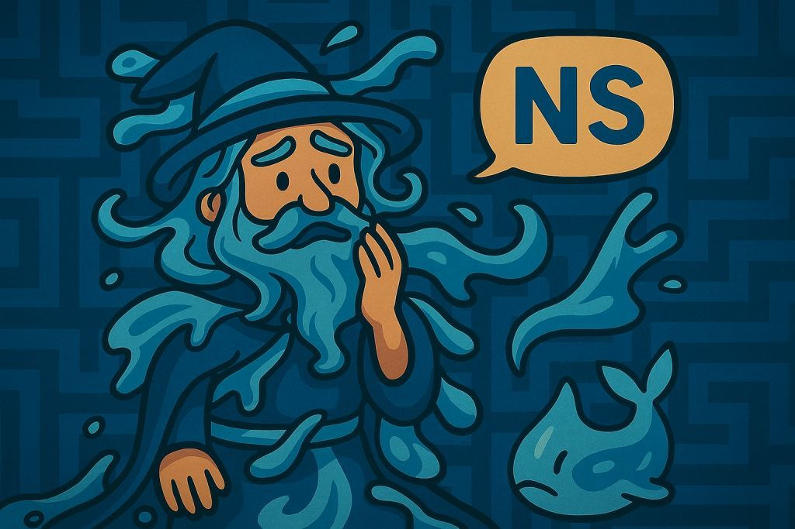

# 🧪 Welcome to the Smoothness Lab

Ah… so you chose to walk into `/specs`.

Which means…

You must be fluent in **Specifications**,  
skilled in **API diagrams**,  
versed in **modular graphs**,  
and a master of **parameter tuning**.

Perfect.  
That makes you the *ideal* candidate for this challenge.

---

## 🌊 Who am I?

I am the Navier–Stokes Wizard —  
practitioner of continuous flows,  
keeper of the invisible vortices,  
guardian of the smoothness hypothesis.

> 📜 The **Navier–Stokes Existence & Smoothness Problem** asks:  
> Can we prove that 3D fluid equations always have a smooth solution over time?  
> Or will the equations break down and spawn chaos — singularities in the flow?

Unsolved since the early 20th century.  
Still worth **$1,000,000** from the Clay Millennium Prize.

---

## 😑 Oh... you're one of *those* adventurers.

You’re not here to solve it, are you?

You’re just poking around folders,  
searching for treasure chests like this is some RPG,  
barging into my lab and hoping to loot a secret scroll.

---

> *“How did we go from millennium math to folder looters...”*  
> *...murmur... why are all the heroes these days just in and out like tourists...”*

